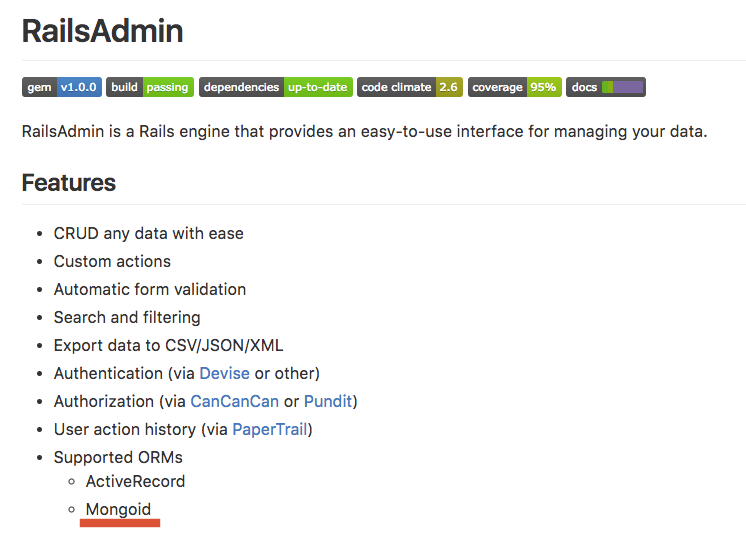
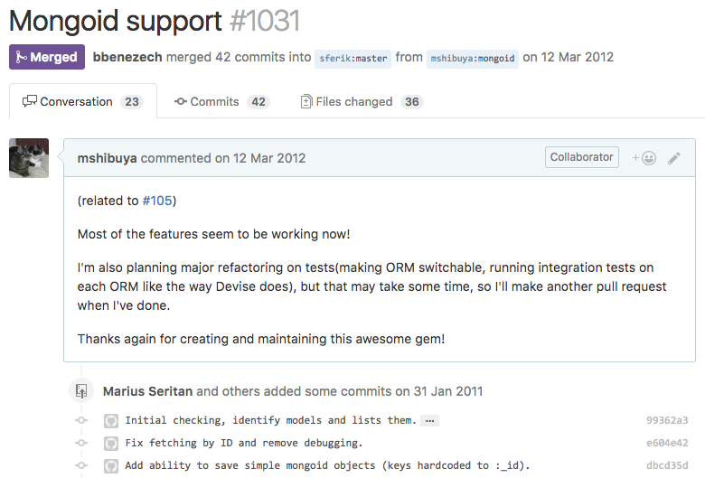
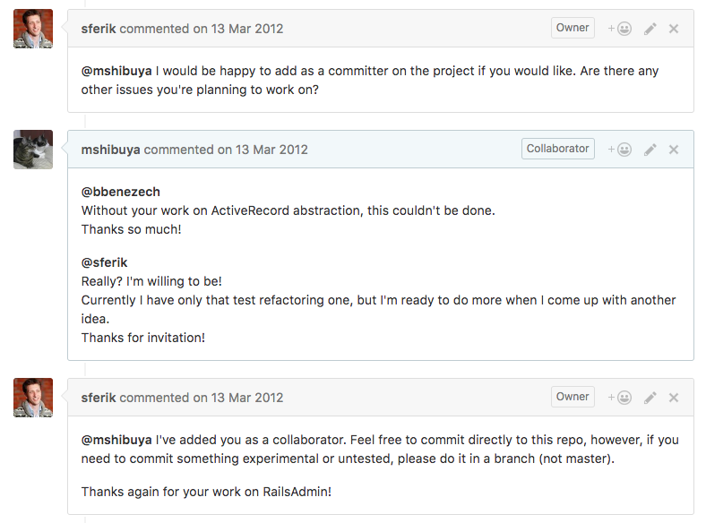
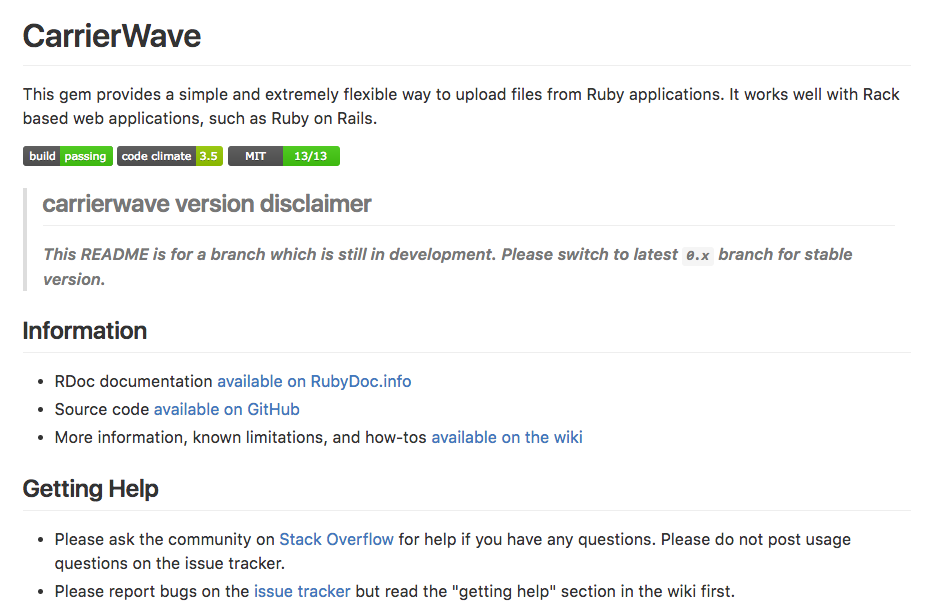
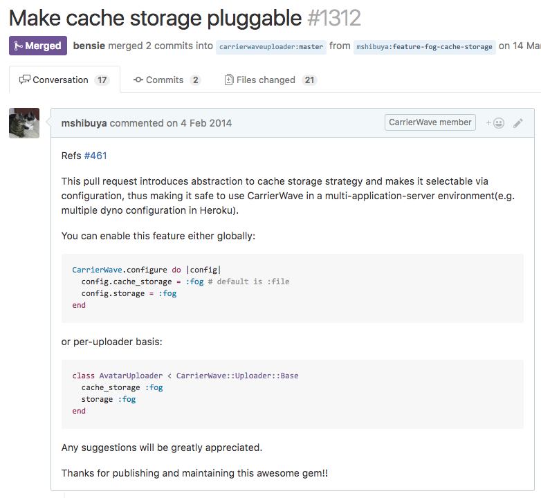
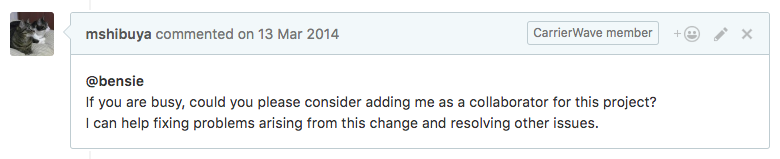
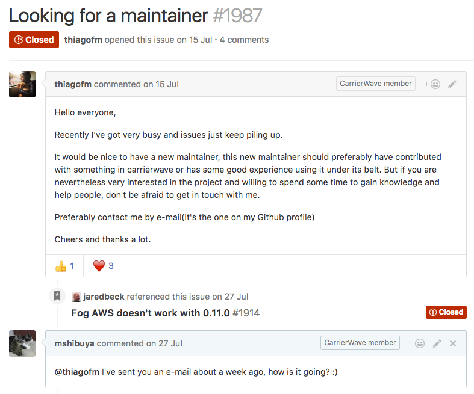

# 著名OSSのコミッタになった話
subtitle
:   2016/10/28 オプト 社内勉強会

allotted-time
:   15m

===

# アジェンダ
- 経緯
- コミッタとしての心構え
- コントリビュートにあたってのtips

# 経緯
{:relative_height="100"}

# RailsAdmin
- 基本的な管理画面がお手軽にできちゃうRailsプラグインです

# RailsAdmin
{:relative_height="100"}

# RailsAdmin
{:relative_height="100"}

# RailsAdmin
{:relative_height="100"}

# RailsAdmin
コミッタにしてくれた

# CarrierWave
- 画像など、ファイルのアップロードがいい感じにできるライブラリです
- ActiveRecordをはじめ、いろんなORMに対応

# CarrierWave
{:relative_height="100"}

# CarrierWave
{:relative_height="100"}

# CarrierWave
{:relative_width="100"}

この時はスルーされた

# CarrierWave
{:relative_height="100"}

# CarrierWave
名乗り出たらコミッタにしてくれた

# わりと簡単になれる
- 大きめの or 継続的な貢献をする
- 機会を伺う
- ねじ込む

# コミッタとしての心構え
{:relative_height="100"}

# OSSは泳ぎ続けないと死ぬ
- 言語や依存ライブラリが進化していくので、止まっているだけでどんどん時代遅れになる
- ある程度の頻度でリリース
- ちょっとだけでもいいので、手を入れ続ける
- 続けるだけでも差別化になる！

# 得意技
issueやPRによく使うコメントたち

- Full stack trace, please.
- Test needed!
- Please use StackOverflow for the support request, thanks.
- Too old, closing.

# コントリビュートにあたってのtips
{:relative_height="100"}

# PR前
- テストは必ず書く！
  - その他、CONTRIBUTING.mdに書いてあることに従おう
- 実装する

# PR
- テンプレ
  - Hello!
  - 動機・解決したい問題
  - どう解決したか
  - Thanks for creating/maintaining this awesome library!

# PR後
- 1週間は待つ
- Any thoughts?
- Hi, what can I do to get this merged in?
- Need help with maintenance?

# 心構え
- 必ず取り入れてくれるとも限らない
  - そもそも設計思想と違うような変更はマージしてもらえない可能性が高い
  - ただ、こうした方がいいよみたいな返事はだいたいくれる

# 心構え
- でも、自分が直面した問題は世界の誰かも直面する可能性が高い
- 世界中で何度も何度も何度も同じ問題を解決するのは本当に無駄！
  - 俺が作ったイケてる解決策を使いやがれ！

# まとめ
- ある程度名の知れたOSSでも、結構しょうもない部分は多い
- みんなで気軽にコントリビュートしよう！
