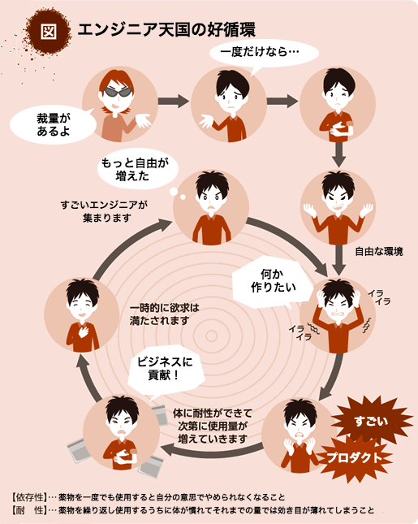
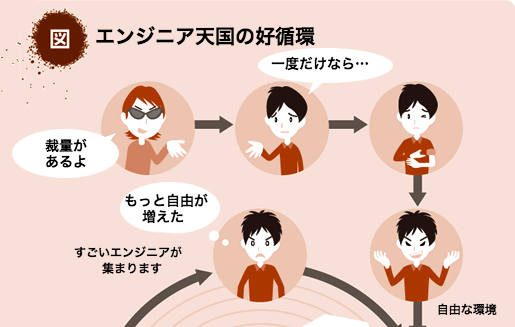
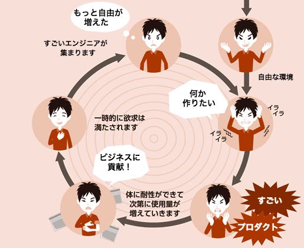
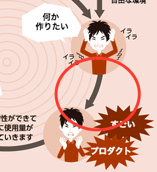

# エモい話
subtitle
:   2016/10/27 オプト エモい会議

author
:   開発２部 渋谷

allotted-time
:   15m

===

# アジェンダ

* これまで
* これから

# これまで

わりとクズっぽい感じ

# 経歴
* 10才くらいからプログラム書いてました

# 経歴
* 10才くらいからプログラム書いてました
* 東京大学文科三類入学

# 経歴
* 10才くらいからプログラム書いてました
* 東京大学文科三類入学
* メンヘラになり中退

# 経歴
* 10才くらいからプログラム書いてました
* 東京大学文科三類入学
* メンヘラになり中退
* 空白の7年間

# 経歴
* 10才くらいからプログラム書いてました
* 東京大学文科三類入学
* メンヘラになり中退
* 空白の7年間
* 社会復帰

# 経歴
* 10才くらいからプログラム書いてました
* 東京大学文科三類入学
* メンヘラになり中退
* 空白の7年間
* 社会復帰
* DSSに流れ着く

# 趣味プログラマー
* ?
* 課題を解決
* 達成感

# 趣味プログラマー
* (なに作ろう…？)
* 課題を解決
* 達成感

# 職業プログラマー
* ?
* 課題を解決
* 達成感

# 職業プログラマー
* ビジネス上の課題
* 課題を解決
* 達成感

# 職業プログラマー
* ビジネス上の課題
* 課題を解決
* 達成感
* 給料が出る

# 職業プログラマー
* ビジネス上の課題
* 課題を解決
* 達成感
* 給料が出る

ぼろ儲け！！！

# これから
目指したい世界

# エンジニア天国
ぼくのかんがえたさいきょうのえんじにあそしき

# エンジニア天国

{:relative_height="100"}

# エンジニア天国

{:relative_height="100"}

# エンジニア天国

{:relative_height="100"}

# エンジニア天国

{:relative_height="60"}

本当に……？

# 目標

仕事しなくていい会社になるといいな！

# おわり

質問などお待ちしてます！！
