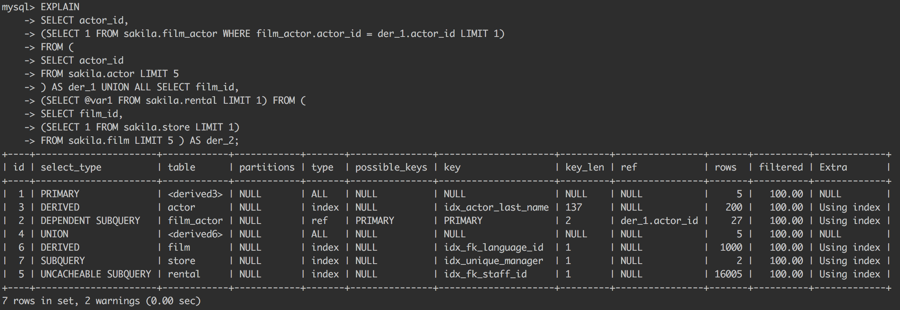

# EXPLAIN explained 〜MySQL EXPLAINの読み方入門〜

subtitle
:   2017/8/4 オプト社内勉強会

allotted-time
:   30m

# 自己紹介
渋谷　充宏 @m4buya

* なんでも屋
* サーバーサイドプログラマだった
* Ruby / Scala / インフラ(New!)
* https://github.com/mshibuya
* RailsAdmin/CarrierWave committer

# ねらい

MySQLのEXPLAINのポイントをなんとなくつかめるようになる

# アジェンダ

- EXPLAINとは
- 事前知識
- EXPLAINで出る各項目の解説
- 時間があればデモ？
- まとめ

# EXPLAINとは

こんなやつ

{:relative_width="100"}

# EXPLAINとは

- MySQLがクエリをどう実行しようとしているかを表したもの
- クエリ・テーブル構造・データについての統計情報などをもとに様々な実行プランについてのコストを比較・検討し、最終的な実行プランとなる

# EXPLAINとは

データ量は大変重要！

- データの統計情報はデータをもとに概算する
- 本番相当のデータがある環境でないと、本番で選ばれるようなクエリプランが選択されない可能性が高い

# EXPLAINとは

- 基本的に実際のデータ取得は走らない
- 実際のパフォーマンスを見るには別途クエリを実行して確かめる必要あり！

# 事前知識

- インデックス
- Join

# インデックス
- B+木

こんなやつ

{:relative_width="100"}

# インデックス
- B+木

特徴

- 浅くて済む
- 順番にたどるのも速い

# インデックス

- インデックスとテーブルデータは別の場所に保存されている
- テーブルスキャンはコストが高いが、（同程度のデータなら）インデックススキャンの方がはるかに高コスト
  - テーブルスキャンはシーケンシャルアクセスだが、インデックススキャンはランダムアクセスを要するため

# Join

MySQLが実行できるのは Nested Loop Joinのみ！

- 他にはHash JoinとかSort Merge Joinとかある

# Nested Loop Join

  foreach(rowA in tableA) {
    foreach(rowB in tableB) {
      if(結合条件を満たす(rowA, rowB))
        出力(rowA, rowB);
    }
  }

# 項目別解説
- id
- select_type [まぁ重要]
- table
- type [重要]
- possible_keys

# 項目別解説-2
- key [まぁ重要]
- key_len
- ref
- rows [重要]
- Extra [重要]

# 項目別解説[id]
- id

SELECT相当のものにつけられる、他の部分から参照するための番号

# 項目別解説[select_type]
- select_type [まぁ重要]

クエリタイプ。単純なやつか、複雑か

- SIMPLE
- PRIMARY
- SUBQUERY
- DERIVED
- UNION

# 項目別解説[table]
- table

クエリが対象としているテーブル名

# 項目別解説[id, table]

読み方

{:relative_width="100"}

# 項目別解説[type]
- type [重要]

アクセスタイプ。以下の種類がある

- ALL
  - いわゆるテーブルスキャン
- index
  - インデックス順での読み取り

# 項目別解説[type]

- range
  - 範囲スキャン
- ref
  - インデックス検索
- eq_ref
  - ユニークなインデックス検索

# 項目別解説[type]

- const, system
  - 定数値
- NULL
  - 最適化によりアクセスを要さなくなった

# 項目別解説[possible_keys]
- possible_keys

利用し得るインデックス名

# 項目別解説[key]
- key [まぁ重要]

テーブルのスキャンのために利用することに決めたインデックス名

# 項目別解説[key_len]
- key_len

利用するインデックスの長さ（バイト数）

# 項目別解説[ref]
- ref

インデックスから探そうとしている値またはカラム名

# 項目別解説[rows]
- rows [重要]

MySQLがクエリを処理するためにだいたい取得することが必要だと判断した行の数。
Nested Loop Joinしているので、内側のテーブルは 外側の行数*内側の行数 ぶんの行取得が走ることに注意！

# 項目別解説[Extra]
- Extra [重要]

いろんなのが出る。結構大事なのも出る

- Using where
- Using temporary/Using filesort
- Using index

# Using where

取得した行のうち、WHERE句にマッチしないものを捨てたことを表す。
インデックスを利用できるようにすれば行の取得自体を削減可能。

# Using temporary/Using filesort

ソートやテンポラリテーブルの作成が必要だった時にでる

# Using temporary/Using filesort

どちらも出ない時

{:relative_height="100"}

# Using temporary/Using filesort

Using filesortの時

{:relative_height="100"}

# Using temporary/Using filesort

Using temporary; Using filesortの時

{:relative_height="100"}

# Using index

カバリングインデックスを利用できた時に出る

# そのほかのExtraたち

- Not exists
- Using index condition
- No tables used
- Select tables optimized away

# まとめ

- EXPLAINとは、MySQLがクエリをどう実行しようとしているかを表したもの
- 正しいEXPLAINを出すには、本番相当のデータを用意する必要がある
- typeにはアクセスタイプが出る

# まとめ-2

- rowsは各テーブルへのスキャンの分量がわかるので大事
- Extraにはすごく大事な情報がさりげなく出るのでちゃんと見る

# おまけ

- EXPLAIN EXTENDEDするともう少し情報が増える
  - filteredとか
- JSON形式で出すともっと情報が増える！(5.7以降)
  - EXPLAIN FORMAT=JSON SELECT...
  - コストとか見れる

# おまけ-2

- MySQLのアーキテクチャの話？

# 参考資料

- MySQL 5.6 リファレンスマニュアル
  - https://dev.mysql.com/doc/refman/5.6/ja/explain-output.html
- ハイパフォーマンスMySQL 第3版
- 漢（オトコ）のコンピュータ道 Using filesort
  - http://nippondanji.blogspot.jp/2009/03/using-filesort.html

# おわり
これであなたもEXPLAINの達人!!
